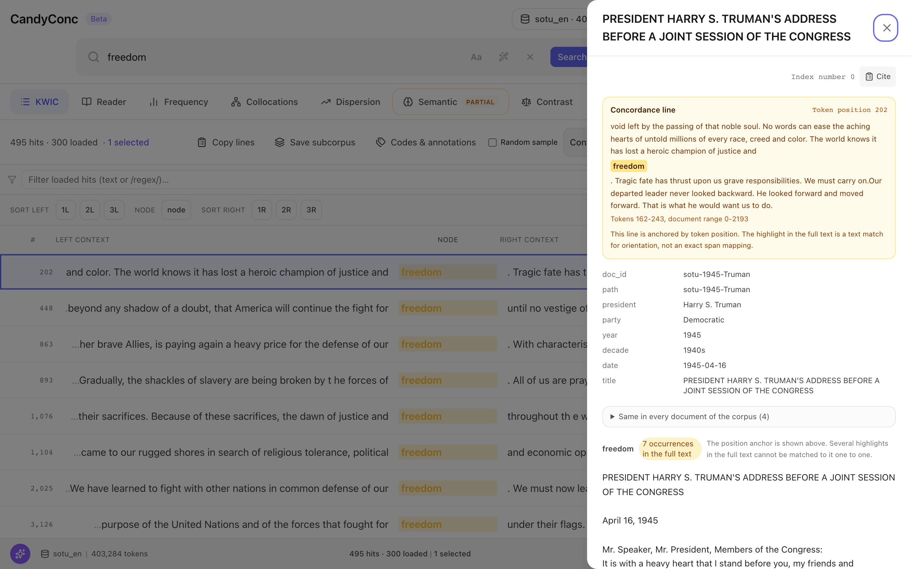
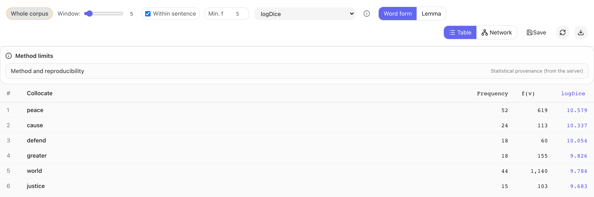
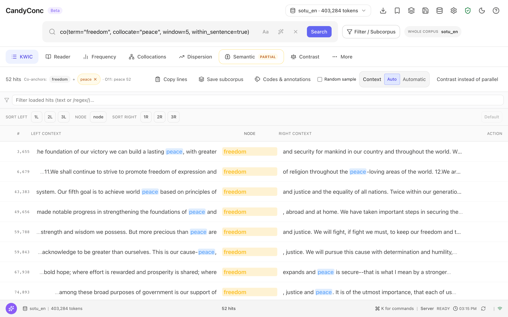

# CandyConc

CandyConc is a corpus analysis system that runs on your own computer. Reading
concordance lines, counting and testing, and asking a language model for help
all work on one local index of your texts, through the same set of analysis
operations. A result in CandyConc is defined by a query, a scope, and the
parameters of an operation, so you can recompute it, see the method behind
it, and open the concordance lines it rests on.

CandyConc runs as a local server with a web interface in your browser, in
English or German. Import, search, analysis, annotation, and export run locally without a
language model. These core functions work without a network connection once
the annotation pipelines you need are installed. Optional model functions
send selected text to the endpoint you configure, as described in
[Data and privacy](docs/concepts/data-and-privacy.md).

Version 0.1.0 is the first public pre-release.



*A concordance line opens in its document, with its token position, the metadata, and every occurrence highlighted in the full text.*

## What you can do with it

A typical study moves between reading and counting:

1. **Bring in texts.** Import CSV, JSON Lines, plain text, Parquet, or VRT
   files, or paired versions of the same texts. You choose the language of
   the corpus, and a spaCy pipeline adds lemmas, parts of speech,
   morphological features, dependency relations, and, on request, named
   entities.
2. **Search and read.** Search word forms, lemmas, parts of speech,
   dependency relations, and sequences, with plain searches or the
   CQP-style query language. Sort the concordance and open any hit in
   the full text of its document, with its metadata.
3. **Narrow the scope.** Build subcorpora from document metadata, such as
   year, author, or party, or from the documents of a search, and save them.
   Every analysis runs on the whole corpus or on a subcorpus.
4. **Count and compare.** Compute frequency lists, collocations with fifteen
   association measures, dispersion across documents, keyness between two
   subcorpora with test statistics and effect sizes, trends along a metadata
   field, n-grams, contrasts, and word sketches.
5. **Go back to the evidence.** A row of a frequency list, a collocation
   table, an n-gram list, a word sketch, a trend, or a contrast opens the
   concordance lines behind it. Where a number is not a count of lines, for
   example a collocation count over overlapping windows, the interface says
   what the number counts and what the lines show. Method cards in the
   analysis views record the measure, formula, scope, settings, and index
   state.
6. **Keep and share.** Export concordances as CSV, TSV, XLSX, JSON, or JSON
   Lines with their provenance, or as an evidence package with checksums.
   Annotate concordance lines with a coding scheme, with several coders and
   agreement measures.





*Collocations with their settings, and the 52 lines behind the collocate peace, the number in the collocation table.*

## How CandyConc supports your research

- **One evidence space.** The concordance, the statistics, the document
  reader, and the copilot use the same index, the same query engine, and the
  same scope. A number and the lines behind it come from the same
  definition.
- **Methods you can check.** Analysis results name their counting units,
  measures, and relevant denominators, following the cited literature, and
  exports record the fingerprint of the index they come from. The
  documentation explains the methods and counting rules with worked examples
  that the test suite recomputes.
- **Choose the corpus language.** The index, the query language, and
  the statistics do not depend on the language. English and German are
  tested end to end. Languages without a trained pipeline can be tokenized
  with `blank:<code>`, without linguistic annotation.
- **A copilot that works with the analyses.** The optional copilot calls
  CandyConc's analysis operations as tools and sees corpus text only through
  their results. Its answers cite those results, and the interface links each
  citation to the result it names. A check without a model removes citations
  that match no result, adds evidence chips to numbers that exactly one result
  contains, and names quotations that appear in no evidence line. It connects to an
  OpenAI-compatible endpoint that you choose, local or remote, and stays off
  until you set one up.
- **Paired texts.** Compare versions of the same source texts, with sentence
  alignment and parallel concordance lines.
- **For one person or a group.** Single-user mode needs no sign-in. A
  multi-user mode adds user accounts, sign-in, and roles.

## Who it is for

Researchers who study language in their own text collections, for example in
corpus linguistics, digital humanities, or the social sciences. Annotation
projects that code concordance lines with several coders. Studies that
compare versions of the same texts. Groups that share one server.

## Install

Each release provides an application bundle that contains its own Python and
needs no other software, Python wheels, and a source distribution.
[Supported platforms](docs/reference/supported-platforms.md) lists the systems
each release covers. Download the bundle from
[Releases](https://github.com/miweru/CandyConc/releases). On a Mac with Apple
silicon, open Terminal in the download folder and run:

```bash
tar -xzf CandyConc-*-macos-arm64.tar.gz
xattr -dr com.apple.quarantine CandyConc-*-macos-arm64
cd CandyConc-*-macos-arm64
./candyconc
```

The `xattr` command clears the macOS download quarantine for this unpacked
CandyConc copy. The address of the web interface appears in the terminal. See
[Install CandyConc](docs/get-started/install.md) and
[Install the Python package](docs/get-started/install-python-package.md).

## Sample data

The folder `examples` contains two sample corpora that the documentation uses:
65 State of the Union addresses from 1945 to 2006 (public domain, from NLTK
Data) and 30 German texts from 1800 to 1899 from the Deutsches Textarchiv
(CC BY-SA 4.0). The tutorial [First results](docs/get-started/first-results.md)
installs its English annotation pipeline, imports that corpus, and takes
you from a search to a collocation and back to the lines.

## Documentation

The documentation is in the folder [docs](docs/index.md), and the interface
opens a local copy under Help:

- [Get started](docs/get-started/index.md): installation and a first result
- [Guides](docs/guides/index.md): import, search, subcorpora, analyses,
  export, copilot, and running a server
- [Concepts](docs/concepts/index.md): how CandyConc works, the index, scope,
  from numbers to lines, and the copilot
- [How CandyConc counts](docs/methods/index.md): the statistical methods with
  worked examples
- [Reference](docs/reference/index.md): query language, command line, HTTP
  API, configuration, and file formats
- [Help](docs/help/index.md): FAQ, troubleshooting, and release notes

## Contributing

Contributions are welcome. [CONTRIBUTING.md](CONTRIBUTING.md) explains how to
set up a development environment, run the tests, and propose a change.
Report problems and ask questions in the
[issues of this repository](https://github.com/miweru/CandyConc/issues).

## Citing

If you use CandyConc in your research, cite it with the version you used. The
citation information is in [CITATION.cff](CITATION.cff) and on
[Cite CandyConc](docs/help/cite.md).

## License

CandyConc is released under the [MIT license](LICENSE). Corpus data is not
covered by this license. Each corpus keeps the license of its source,
including the sample corpora in `examples`. See
[Licenses](docs/help/license.md).
